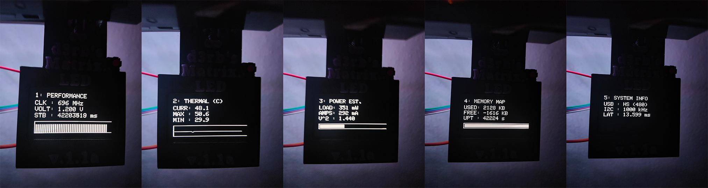
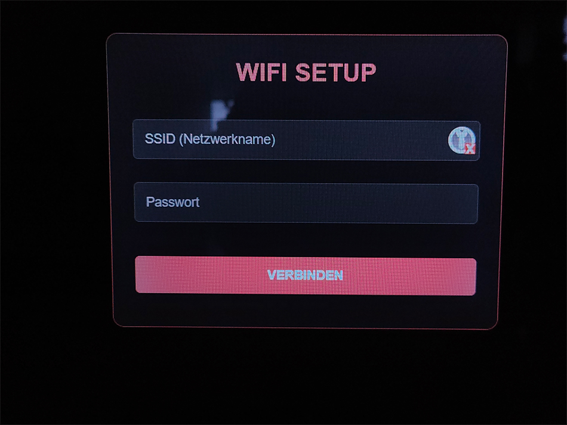
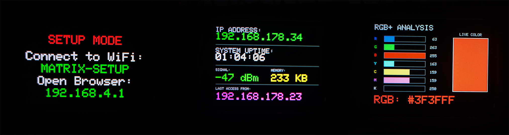

# [MATRIX LED] - "Highspeed Ambilight & WebUi"

## Einleitung
MATRIX LED ist ein High-Performance Ambilight-Projekt mit dem klaren Fokus auf **maximale Geschwindigkeit, minimale Latenz und vollständige Messbarkeit**.
Dieses Projekt ist nicht als weiteres „Ambilight für den Alltag“ entstanden, sondern aus der Frage heraus:

> *Wie schnell können adressierbare LEDs wirklich angesteuert werden – wenn man nichts künstlich limitiert?*

## Projektbeschreibung
MATRIX LED kombiniert zwei Welten:
- **Teensy 4.x** als extrem schneller, deterministischer LED-Controller
- **ESP32** als Steuer-, UI- und Konfigurations-Einheit (Webserver + Display)
- Der kritische Datenpfad (PC → LEDs) ist **bewusst frei von WLAN, TCP/IP oder Betriebssystem-Jitter** gehalten.
- Der ESP32 übernimmt ausschließlich Komfort- und Kontrollfunktionen.

## Nerd Stuff – Pipeline (Kurzfassung)
PC → USB → Teensy (DMA) → LEDs  
ESP32 → UI / Web / Display (nicht zeitkritisch)

# Features

* - **Teensy 4.0:**   High-Speed APA102 Treiber (SPI @ 16MHz), USB Adalight Interface, OLED Status-Display.
* - **OLED Display:** FPS Counter, (Reale FPS Berechnung), / Bootscreen / LED Test (automatisch (Boot) per Taster). Debug Menü / EEPROM Lesen & Schreiben.
* - **Ambilight:**    Unterstützt PC-Synchronisation via USB (Adalight Protokoll, funktioniert mit AmbiPro / Hyperion / HyperHDR / Prismatic und eigene Software MATRIX LED (noch nicht veröffentlicht)
 

[Performance HUD:] Framerate / CPU Temperature / CPU Usage / Data Rate / Free RAM / SPI Frequency

 

##

 
[Debug Menü:] Performance / Thermal CPU / Power / Memory / Sys Info

* - **ESP32:**         Webinterface, WiFi-Management, Effekt-Berechnung.
* - **Web Interface:** Modernes React-basiertes UI zur Steuerung von Effekten, Farben und Helligkeit uvm.
* - **Effekte:**       "Für LED Test" -> Matrix LED, Rain, >_ CODE X, Fire, Plasma, Rainbow, uvm. (Canvas2D@4K) benötigt schnellen CPU.
* - **TFT Display**    MAtrix Regen passt sich den Farben der LEDs an (int bucketCounts[7] Teensy sortiert Farben in 7 Töpfe (R, Y, G, C, B, M, K) und nimmt den vollsten,

 
 

## [ Downloads & Extras ]

### 🌐 Web Interface (High-Res Version)
Da das Hintergrundbild (3.3 MB) zu groß für den internen Speicher des ESP32 ist, kann die **High-Quality Version** der Website hier heruntergeladen werden.
*   Einfach die `.html` Datei lokal am PC/Handy öffnen.
*   Die IP-Adresse des ESP32 kann in der lokalen Version konfiguriert werden.
*   **Download:** Siehe **Releases** (rechts in der Sidebar).

### 🖨️ 3D Druck (.stl)
Gehäuse-Dateien für den Controller und die Anschlüsse.
*   *(Dateien folgen in Kürze / Siehe Ordner `STL`)*

 

## Hardware Specs

* - **Controller 1:** Teensy 4.0 @ 696 MHz "Overclocked"
* - **LEDs:**         APA102C (SPI) @ 16 MHZ
* - **Display:**      SH1106 OLED (I2C) @ 1 MHz

* - **Controller 2:** ESP32 DevKit V4 @ DualCore 240 MHZ EnergySaver deaktiviert
* - **Display:**      ST7789V 240x320 (SPI) @ 26.6 MHZ

## [ HIGH-PERFORMANCE PIPELINE ARCHITECTURE @ Teensy 4.0 ]
  
 1. CORE ARCHITECTURE  (Teensy 4.0) (Cortex-M7)
 * - High-performance NXP i.MX RT1062 crossover MCU delivers real-time operation 
 * - Clock: 696 MHz (Overclocked via CCM registers)
 * - VCore: 1.200V (Dynamic Voltage Scaling via PMU_REG_CORE 0x14)
 * - FPU:   Double Precision Hardware Floating Point Unit enabled
   
 2. MEMORY HIERARCHY (Tightly Coupled Memory)
 * - ITCM (Instruction TCM): 64-bit Bus, 0 Wait-States.
 * - Hält "Hot Path" Code: processLEDs(), sendOutBuffer(), readExact().
 * - Verhindert Cache-Misses und Pipeline-Stalls bei kritischen Loops.
 * - DTCM (Data TCM): 64-bit Bus, 0 Wait-States.
 * - Hält Stack, Frame-Buffer (rgbIn, outBufA/B) und globale Variablen.
 * - Ermöglicht Single-Cycle Zugriff auf LED-Daten.
   
## [ DATA PIPELINE: "ZERO-COPY" DOUBLE BUFFERING ]

 STAGE 1: INGEST (USB High-Speed 480 Mbit/s)
 *  - Hardware: USB PHY -> Internal 512 Byte DMA Ring Buffer.
 *  - Software: readExact() (ITCM) liest Block-weise in 'rgbIn' (DTCM).
 *  - Protocol: Adalight Header Check ("Ada") + Checksum/Timeout Logic.
    
 STAGE 2: PROCESSING (SIMD-like Integer Math)
 *  - Function: processLEDs() (ITCM, FASTRUN).
 *  - Input:    8-Bit RGB Array (rgbIn).
 *  - Op:       Bit-Shifting & Masking (keine Divisionen).
 *  - Scaling:  Fixed-Point Helligkeitsberechnung ((val * brightness) >> 8).
 *  - Feature:  Color Clustering (Smart Downsampling) for ESP32 Preview.
 *  - Output:   32-Bit APA102 Frames (0xFF | B | G | R) direkt in 'backBuf'.

 STAGE 3: SWAP (Atomic Transition)
 * - Trigger:  Sobald Frame vollständig verarbeitet ist.
 * - Action:   Pointer Swap (frontBuf <-> backBuf).
 * - Cost:     Nahezu 0 CPU-Zyklen (nur Zeiger-Adressen tauschen).
   
 STAGE 4: PRIMARY EGEST (LPSPI Output @ 16 MHz)
 * - Hardware: Low Power SPI (LPSPI) Modul.
 * - Function: sendOutBuffer() (ITCM).
 * - Data:     Liest von 'frontBuf' (DTCM).
 * - Timing:   Asynchron zur USB-Eingabe (entkoppelt durch Buffer).
   
 STAGE 5: SECONDARY EGEST (UART @ 4 Mbit/s)
 * - Hardware: High-Speed UART (Serial1).
 * - Target:   ESP32 Web Controller (Telemetry & Preview).
 * - Data:     Cluster-Downsampled RGB + Status (Binary Protocol).

## [ TELEMETRY & SUPERVISOR ]

 * - LPI2C (OLED): Overclocked auf 1 MHz (Fast Mode Plus) für min. Latenz.
 * - FPS Engine:   Exponential Moving Average (EMA) Filter für glatte Anzeige.
 * - 3D Engine:    Real-time FPU projection engine (Boot Animations).
 * - Diagnostics:  Startup Benchmarking (I2C Latency Check).
 * - Thermal:      Überwachung der Die-Temperatur (tempmon).
 * - Load Monitor: Messung der aktiven CPU-Zyklen vs. Idle-Time.
 * - Watchdogs:    Screensaver (20s Idle) & Deep Standby (10min Idle).

## Benchmark-Disclaimer (WICHTIG)

 * - FPS-Werte beschreiben den **internen Durchsatz**, nicht die sichtbare Bildrate.
 * - Überabtastung dient Messung & Verifikation – nicht Darstellung.

 
 

## [ HIGH-PERFORMANCE PIPELINE ARCHITECTURE @ ESP32 ]

 1. CORE ARCHITECTURE (ESP32-D0WD) (Dual-Core Xtensa LX6)
 * - Clock: 240 MHz (Max Performance Profile via setCpuFrequencyMhz).
 * - Cores: Asymmetric Multiprocessing (AMP).
 * - **Core 0:** High-Speed Serial Ingest & Protocol Parsing.
 * - **Core 1:** UI Rendering, WiFi Stack, WebServer & State Logic.

 2. DISPLAY SUBSYSTEM
 * - Driver: TFT_eSPI (Hardware SPI).
 * - Mode:   Direct Framebuffer Access.

## [ DATA PIPELINE: DUAL-CORE PARALLELISM ]

 STAGE 1: INGEST (Core 0 - Background Task)
 * - Source:   UART2 (Serial2) @ 4 Mbit/s from Teensy 4.0.
 * - Buffer:   Expanded RX Buffer (2048 Bytes) via setRxBufferSize().
 * - Function: serialDataReceiverTask() -> processTeensySerialData().
 * - Logic:    Binary Header Search (0x42, 0x4D) -> State Extraction.
 * - Output:   Writes to volatile global registers (teensyR/G/B).

 STAGE 2: STATE MANAGEMENT (Shared Memory)
 * - Type:     Volatile Global Variables.
 * - Sync:     Implicit Atomic 32-bit Access (No Mutex needed for simple ints).
 * - Data:     Color Data (RGB), System Mode (Matrix/Data/Off).

 STAGE 3: RENDERING & LOGIC (Core 1 - Main Loop)
 * - Context:  Arduino loop().
 * - Input:    Reads volatile globals.
 * - Graphics: Matrix Rain Engine (Char-based) or Data Dashboard (Rect-based).
 * - Network:  Async WebServer Handling (server.handleClient).
 * - Sync:     Watchdog on TEENSY_TRIGGER_PIN (Auto-Reboot on Signal Loss).

## [ WEB INTERFACE LAYER ]

 * - Stack:    React 18 + TailwindCSS (Single Page Application).
 * - Storage:  PROGMEM (Flash) -> Served as Raw HTML.
 * - Comms:    REST API (/matrix, /data, /off, /threshold).
 * - Client:   Browser-side rendering (Canvas 2D) for Preview & Controls.

 
 

# [ Installation & Setup ]

## 1. Verkabeln / Wiring

### Verbindung Teensy 4.0 <-> ESP32
| Funktion | Teensy 4.0 Pin | ESP32 Pin | Beschreibung |
| :--- | :--- | :--- | :--- |
| **Serial RX** | 0 (RX1) | 17 (TX2) | Daten vom ESP zum Teensy |
| **Serial TX** | 1 (TX1) | 16 (RX2) | Daten vom Teensy zum ESP |
| **Sync/Trigger** | 3 | 33 | Synchronisation & Reset |
| **GND** | GND | GND | **WICHTIG:** Gemeinsame Masse verbinden! |

### ESP32 Display (ST7789 SPI)
*Die Pins sind in der `platformio.ini` definiert:*
*   **MOSI:** GPIO 23 / **SCLK:** GPIO 18 / **CS:** GPIO 26 / **DC:** GPIO 27 / **RST:** GPIO 4

### Teensy 4.0 Peripherie
| Komponente | Pin | Anmerkung |
| :--- | :--- | :--- |
| **LED Data** | 11 | APA102 Data (Grün) |
| **LED Clock** | 13 | APA102 Clock (Gelb/Blau) |
| **OLED SDA** | 18 | I2C Data (SH1106) |
| **OLED SCL** | 19 | I2C Clock (SH1106) |
| **Button** | 2 | Taster gegen GND |

## 2. Teensy 4.0 flashen

* - Benötigte Software: Teensy Loader
* - Datei: `Firmware/Teensy_Matrix.hex` / Die kompilierten Firmware-Dateien befinden sich im Ordner `Firmware`.
* - Verbinde den Teensy per USB, drücke den **weißen Programmier-Knopf** auf dem Teensy und lade die .hex Datei hoch.
* - jetzt sollte dein Teensy Booten, du solltest jetzt den "Learning Mode" Screen sehen, weil das "Magic Byte" noch nicht vorhanden ist.
* - Du kannst jetzt deine LEDs manuel Konfigurieren, oder nutzt einfach den "AUTOMODE start software" , indem du zb. HyperHDR öffnest und schon wird die LED Anzahl die du in der Software festgelegt hast, an den Teensy übertragen werden. Im Display siehst du kurz die Anzahl deiner LEDs.
* - Der Teensy Boote jetzt durch, deine LEDs sollten nach dem Booten leuchten, "LED Test" steht im Display.
* - Sollte etwas schief gegangen sein, kannst du ein "Rest" durchführen, oder konfigurierst die LEDs später im Webinterface.

* - **Reset der Konfiguration:** Per externem Taster (Pin 2)

* - Trenne den Teensy vom Strom (USB raus).
* - Halte den **externen Taster** (an Pin 2) gedrückt.
* - Stecke USB wieder ein (während du gedrückt hältst).
* - Auf dem Display sollte kurz "RESET CONFIG..." erscheinen.
* - Lass den Taster los -> Der Teensy startet jetzt im Learning Mode.

 
<table width="100%">
  <tr>
    <td width="50%" align="center">
      <video src="https://github.com/user-attachments/assets/e9165aa0-0261-4dd2-9a13-92a1aac94c6b" autoplay loop muted playsinline width="100%"></video>
    </td>
    <td width="50%" align="center">
      <video src="https://github.com/user-attachments/assets/cbba1fce-c0b9-42b0-bc78-3b1bd68267d4" autoplay loop muted playsinline width="100%"></video>
    </td>
  </tr>
</table>

## 3. ESP32 flashen
* - Benötigte Software: Esptool oder ESP Download Tool.
* - **Partitionstabelle:** `Firmware/ESP32_partitions.bin` an Adresse `0x8000`
* - **Firmware:** `Firmware/ESP32_Matrix.bin` an Adresse `0x10000`

## 4. Setup & Konfiguration

### 1. Hardware verbinden
Stelle sicher, dass ESP32 und Teensy korrekt miteinander verbunden sind (siehe Tabelle oben: RX/TX, Sync, GND).

### 2. Erster Start (WiFi Einrichtung)
Beim ersten Start (oder nach einem Reset) findet der ESP32 keine gespeicherten WLAN-Daten.
*   Der ESP32 startet einen eigenen Access Point: **`MATRIX-SETUP`**.
*   Auf dem Display erscheint: **"SETUP MODE"** und die IP **`192.168.4.1`**.

**Schritte:**
1.  Verbinde dein Handy oder PC mit dem WLAN **`MATRIX-SETUP`**.
2.  Öffne den Browser und gehe auf `http://192.168.4.1`.
3.  Gib deine **WLAN-SSID** und das **Passwort** deines Heimnetzwerks ein.

4.  Klicke auf "VERBINDEN".
5.  Das System speichert die Daten, startet neu und verbindet sich automatisch mit deinem Heimnetzwerk.

 

### 3. Normaler Start
Nach erfolgreicher Konfiguration lädt der ESP32 die Daten, verbindet sich mit dem WLAN und zeigt die IP-Adresse kurz auf dem Display an. Danach startet die Matrix-Oberfläche.

### 4. WLAN ändern / Reset
Um die WLAN-Daten zu löschen und den Setup-Modus erneut zu starten:

*   **Methode A (Hardware):**
    1.  Schalte den ESP32 ein.
    2.  Innerhalb der ersten **1.5 Sekunden** (während der Boot-Text "Hold BOOT to Reset..." sichtbar ist), halte den **BOOT-Button** gedrückt.
    3.  Das Display wird rot ("RESET WIFI..."), die Daten werden gelöscht und das Gerät startet im AP-Modus neu.

*   **Methode B (Software):**
    Rufe im Browser die URL `http://<DEINE-ESP-IP>/reset_wifi` auf.

### 5. Zugangsdaten (OTA Update)
Für Firmware-Updates über das Webinterface (`/upload`):
*   **Benutzername:** `admin`
*   **Passwort:** `matrix`

## 5. Tastenbelegung / Button Functions

### Teensy 4.0 (Externer Taster an Pin 2)
| Aktion | Funktion |
| :--- | :--- |
| **Beim Start gedrückt halten** | **Reset der Konfiguration:** Löscht die gespeicherte LED-Anzahl und andere Einstellungen. Der Teensy startet im "Learning Mode". |
| **1x Klick** | Startet den **LED-Selbsttest** (Knight-Rider-Effekt). |
| **2x Klick** | Schaltet die **globale Helligkeit** um (100% → 50% → 15% → 100%). |
| **5x Klick** | Öffnet das **Debug-Menü** auf dem OLED-Display. |
| **Lang gedrückt (>1s)** | Schaltet das OLED-Display an/aus (**Stealth Mode**). |
| **Im Debug-Menü: 1x Klick** | Blättert zur nächsten Seite. |
| **Im Debug-Menü: Lang gedrückt** | Verlässt das Debug-Menü. |

### ESP32 (BOOT-Taster auf dem Board)
| Aktion | Funktion |
| :--- | :--- |
| **Beim Start (1.5s Fenster)** | **WLAN-Reset:** Löscht die gespeicherten WLAN-Daten (siehe Setup). |
| **1x Klick (im Betrieb)** | Ändert die Fallgeschwindigkeit des **Matrix-Regens** auf dem ESP32-Display. |

 
[WebUi]

 

## Links zu Komponenten & Software
*   **Teensy 4.0:**                    https://www.pjrc.com/store/teensy40.html
*   **Display ST7789V 240x320 (SPI):** https://de.aliexpress.com/item/1005009741238384.html
*   **Display SSD1306:**               https://de.aliexpress.com/item/1005006141235306.html
*   **ESP32-WROOM-32D:**               https://de.aliexpress.com/item/1005007820190456.html
*   **APA102:**                        https://de.aliexpress.com/item/32969463242.html
*   **Level Shifter SN74AHCT125N:**    https://de.aliexpress.com/item/1005010466137824.html
*   **Taster Kailh 6x6x7.3mm:**        https://de.aliexpress.com/item/1005005497422200.html

## AboutME

Mich haben Computer und technische Geräte schon immer fasziniert. Das begann bereits in meiner Kindheit, als mein Vater einen Commodore Plus/4 besaß. Von dort aus entwickelte sich meine Reise weiter – über den Amiga 1200, einen 486DX2 und viele weitere Systeme bis heute.

Technik war für mich nie nur ein Werkzeug, sondern etwas, das man verstehen, erkunden und verbessern kann.

Die ersten Ambilight-Systeme, die ich selbst besessen habe, waren noch sehr einfach: drei LED-Leisten, nicht adressierbar, physisch nur wenige LEDs – weit entfernt von dem, was heute möglich ist. Doch LEDs haben mich schon immer begeistert, vor allem wegen ihrer Farben, Dynamik und der Möglichkeiten, Atmosphäre zu erzeugen.

Aus dieser Begeisterung heraus entstand dieses Projekt. Mein Ziel war es nicht nur, ein Ambilight zu bauen, das gut aussieht, sondern eines, das messbar, erklärbar und technisch nachvollziehbar ist – mit klaren Antworten auf Fragen wie:
"Wie schnell ist es wirklich? Wo liegen die Grenzen? Und wie viel Performance bleibt oft ungenutzt?"

Der Name MATRIX LED entstand eher intuitiv. Ich fand ihn einfach passend – und er lässt Raum für Fantasie. Wie der Film Matrix steht er für Technik, Tiefe und die Idee, hinter die Oberfläche zu schauen.

Was als kleines Experiment begann, ist mit der Zeit gewachsen. Nicht aus dem Wunsch nach Komplexität, sondern aus Neugier – und aus dem Spaß daran, Dinge weiterzudenken, zu optimieren und neu zu gestalten. Ich hoffe euch gefällt mein Projekt!!

grüße -= d3rb =-

 
## Support & Kontakt
Gefällt dir das Projekt?
*   Lass einen ⭐ **Star** auf GitHub da!
*   Melde Fehler unter **Issues**.

### ☕ Support
Wenn du meine Arbeit unterstützen möchtest:
*   [PayPal Spende](https://www.paypal.com/donate/?hosted_button_id=9NSRVUTJ6Z2HL)

## Lizenz
Binary-only Distribution.