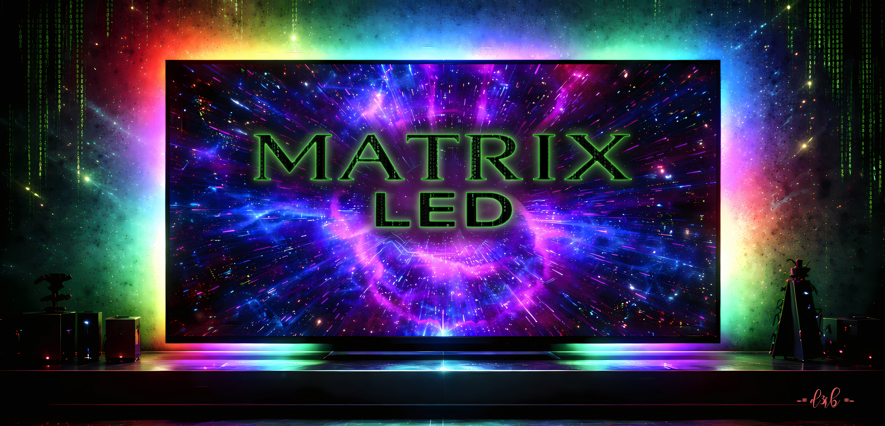
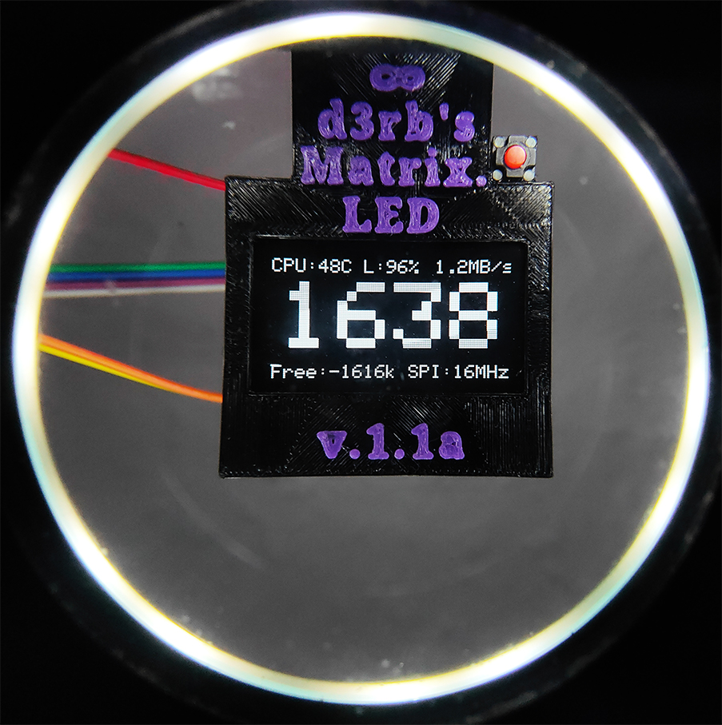
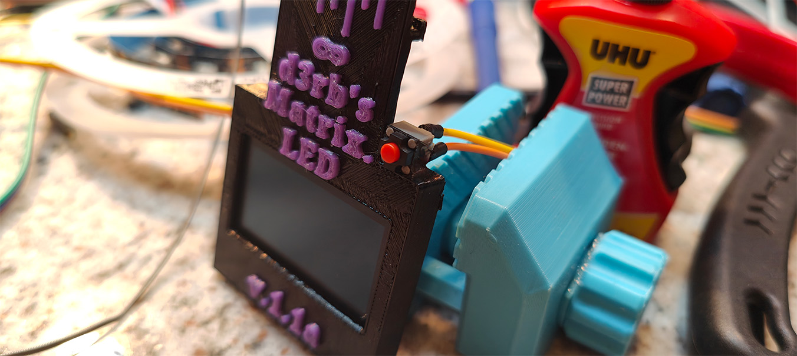
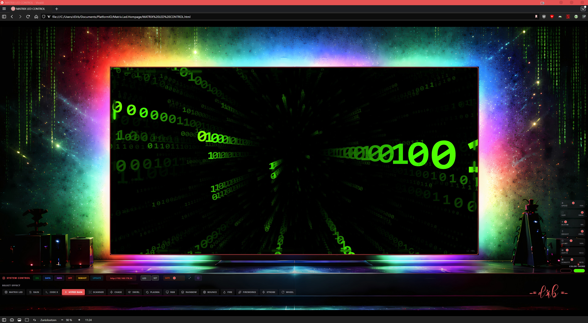

# MATRIX LED Controller 

High-Performance LED Controller System bestehend aus einem ESP32 (Web UI & Effekte) und einem Teensy 4.0 (LED Treiber & USB Interface).

# Features

* - **ESP32:** Webinterface, WiFi-Management, Effekt-Berechnung.
* - **Web Interface:** Modernes React-basiertes UI zur Steuerung von Effekten, Farben und Helligkeit uvm.
* - **Effekte:** Matrix Rain (3D/2D), Fire, Plasma, Rainbow, uvm.
* - **Ambilight:** Unterstützt PC-Synchronisation via USB (Adalight Protokoll, funktioniert mit Prismatik/Hyperion/HyperHDR/AmbiPro).
* - **Teensy 4.0:** High-Speed APA102 Treiber (SPI @ 16MHz), USB Adalight Interface, OLED Status-Display.
* - **OLED Display:** FPS Counter, (Reale FPS Berechnung), / Bootscreen / LED Test (automatisch (Boot) per Taster). Debug Menü / EEPROM Lesen & Schreiben

# Vorwort

Mich haben Computer und technische Geräte schon immer fasziniert. Das begann bereits in meiner Kindheit, als mein Vater einen Commodore Plus/4 besaß. Von dort aus entwickelte sich meine Reise weiter – über den Amiga 1200, einen 486DX2 und viele weitere Systeme bis heute.

Technik war für mich nie nur ein Werkzeug, sondern etwas, das man verstehen, erkunden und verbessern kann.

Die ersten Ambilight-Systeme, die ich selbst besessen habe, waren noch sehr einfach: drei LED-Leisten, nicht adressierbar, physisch nur wenige LEDs – weit entfernt von dem, was heute möglich ist. Doch LEDs haben mich schon immer begeistert, vor allem wegen ihrer Farben, Dynamik und der Möglichkeiten, Atmosphäre zu erzeugen.

Aus dieser Begeisterung heraus entstand dieses Projekt. Mein Ziel war es nicht nur, ein Ambilight zu bauen, das gut aussieht, sondern eines, das messbar, erklärbar und technisch nachvollziehbar ist – mit klaren Antworten auf Fragen wie:
"Wie schnell ist es wirklich? Wo liegen die Grenzen? Und wie viel Performance bleibt oft ungenutzt?"

Der Name MATRIX LED entstand eher intuitiv. Ich fand ihn einfach passend – und er lässt Raum für Fantasie. Wie der Film Matrix steht er für Technik, Tiefe und die Idee, hinter die Oberfläche zu schauen.

Was als kleines Experiment begann, ist mit der Zeit gewachsen. Nicht aus dem Wunsch nach Komplexität, sondern aus Neugier – und aus dem Spaß daran, Dinge weiterzudenken, zu optimieren und neu zu gestalten. Ich hoffe euch gefällt mein Projekt!!

grüße -= d3rb =-

## Hardware Specs

* - **Controller 1:** Teensy 4.0 @ 696 MHz "Overclocked"
* - **LEDs:** APA102C (SPI) @ 16 MHZ
* - **Display:** SH1106 OLED (I2C) @ 1 MHz

* - **Controller 2:** ESP32 DevKit V4 @ DualCore 240 MHZ EnergySaver deaktiviert
* - **Display:** ST7789V 240x320 (SPI) @ 26.6 MHZ

## [ HIGH-PERFORMANCE PIPELINE ARCHITECTURE @ Teensy 4.0 ]
  
 1. CORE ARCHITECTURE  (Teensy 4.0) (Cortex-M7)
 * - High-performance NXP i.MX RT1062 crossover MCU delivers real-time operation 
 * - Clock: 696 MHz (Overclocked via CCM registers)
 * - VCore: 1.200V (Dynamic Voltage Scaling via PMU_REG_CORE 0x14)
 * - FPU:   Double Precision Hardware Floating Point Unit enabled
   
 2. MEMORY HIERARCHY (Tightly Coupled Memory)
 * - ITCM (Instruction TCM): 64-bit Bus, 0 Wait-States.
 * - Hält "Hot Path" Code: processLEDs(), sendOutBuffer(), readExact().
 * - Verhindert Cache-Misses und Pipeline-Stalls bei kritischen Loops.
 * - DTCM (Data TCM): 64-bit Bus, 0 Wait-States.
 * - Hält Stack, Frame-Buffer (rgbIn, outBufA/B) und globale Variablen.
 * - Ermöglicht Single-Cycle Zugriff auf LED-Daten.
   
## [ DATA PIPELINE: "ZERO-COPY" DOUBLE BUFFERING ]

 STAGE 1: INGEST (USB High-Speed 480 Mbit/s)
 *  - Hardware: USB PHY -> Internal 512 Byte DMA Ring Buffer.
 *  - Software: readExact() (ITCM) liest Block-weise in 'rgbIn' (DTCM).
 *  - Protocol: Adalight Header Check ("Ada") + Checksum/Timeout Logic.
    
 STAGE 2: PROCESSING (SIMD-like Integer Math)
 *  - Function: processLEDs() (ITCM, FASTRUN).
 *  - Input:    8-Bit RGB Array (rgbIn).
 *  - Op:       Bit-Shifting & Masking (keine Divisionen).
 *  - Scaling:  Fixed-Point Helligkeitsberechnung ((val * brightness) >> 8).
 *  - Feature:  Color Clustering (Smart Downsampling) for ESP32 Preview.
 *  - Output:   32-Bit APA102 Frames (0xFF | B | G | R) direkt in 'backBuf'.

 STAGE 3: SWAP (Atomic Transition)
 * - Trigger:  Sobald Frame vollständig verarbeitet ist.
 * - Action:   Pointer Swap (frontBuf <-> backBuf).
 * - Cost:     Nahezu 0 CPU-Zyklen (nur Zeiger-Adressen tauschen).
   
 STAGE 4: PRIMARY EGEST (LPSPI Output @ 16 MHz)
 * - Hardware: Low Power SPI (LPSPI) Modul.
 * - Function: sendOutBuffer() (ITCM).
 * - Data:     Liest von 'frontBuf' (DTCM).
 * - Timing:   Asynchron zur USB-Eingabe (entkoppelt durch Buffer).
   
 STAGE 5: SECONDARY EGEST (UART @ 4 Mbit/s)
 * - Hardware: High-Speed UART (Serial1).
 * - Target:   ESP32 Web Controller (Telemetry & Preview).
 * - Data:     Cluster-Downsampled RGB + Status (Binary Protocol).

## [ TELEMETRY & SUPERVISOR ]

 * - LPI2C (OLED): Overclocked auf 1 MHz (Fast Mode Plus) für min. Latenz.
 * - FPS Engine:   Exponential Moving Average (EMA) Filter für glatte Anzeige.
 * - 3D Engine:    Real-time FPU projection engine (Boot Animations).
 * - Diagnostics:  Startup Benchmarking (I2C Latency Check).
 * - Thermal:      Überwachung der Die-Temperatur (tempmon).
 * - Load Monitor: Messung der aktiven CPU-Zyklen vs. Idle-Time.
 * - Watchdogs:    Screensaver (20s Idle) & Deep Standby (10min Idle).

## [ HIGH-PERFORMANCE PIPELINE ARCHITECTURE @ ESP32 ]

 1. CORE ARCHITECTURE (ESP32-D0WD) (Dual-Core Xtensa LX6)
 * - Clock: 240 MHz (Max Performance Profile via setCpuFrequencyMhz).
 * - Cores: Asymmetric Multiprocessing (AMP).
 * - **Core 0:** High-Speed Serial Ingest & Protocol Parsing.
 * - **Core 1:** UI Rendering, WiFi Stack, WebServer & State Logic.

 2. DISPLAY SUBSYSTEM
 * - Driver: TFT_eSPI (Hardware SPI).
 * - Mode:   Direct Framebuffer Access.

## [ DATA PIPELINE: DUAL-CORE PARALLELISM ]

 STAGE 1: INGEST (Core 0 - Background Task)
 * - Source:   UART2 (Serial2) @ 4 Mbit/s from Teensy 4.0.
 * - Buffer:   Expanded RX Buffer (2048 Bytes) via setRxBufferSize().
 * - Function: serialDataReceiverTask() -> processTeensySerialData().
 * - Logic:    Binary Header Search (0x42, 0x4D) -> State Extraction.
 * - Output:   Writes to volatile global registers (teensyR/G/B).

 STAGE 2: STATE MANAGEMENT (Shared Memory)
 * - Type:     Volatile Global Variables.
 * - Sync:     Implicit Atomic 32-bit Access (No Mutex needed for simple ints).
 * - Data:     Color Data (RGB), System Mode (Matrix/Data/Off).

 STAGE 3: RENDERING & LOGIC (Core 1 - Main Loop)
 * - Context:  Arduino loop().
 * - Input:    Reads volatile globals.
 * - Graphics: Matrix Rain Engine (Char-based) or Data Dashboard (Rect-based).
 * - Network:  Async WebServer Handling (server.handleClient).
 * - Sync:     Watchdog on TEENSY_TRIGGER_PIN (Auto-Reboot on Signal Loss).

## [ WEB INTERFACE LAYER ]

 * - Stack:    React 18 + TailwindCSS (Single Page Application).
 * - Storage:  PROGMEM (Flash) -> Served as Raw HTML.
 * - Comms:    REST API (/matrix, /data, /off, /threshold).
 * - Client:   Browser-side rendering (Canvas 2D) for Preview & Controls.
 
 
# [ Installation & Setup ]

## 1. Verkabeln / Wiring

### Verbindung Teensy 4.0 <-> ESP32
| Funktion | Teensy 4.0 Pin | ESP32 Pin | Beschreibung |
| :--- | :--- | :--- | :--- |
| **Serial RX** | 0 (RX1) | 17 (TX2) | Daten vom ESP zum Teensy |
| **Serial TX** | 1 (TX1) | 16 (RX2) | Daten vom Teensy zum ESP |
| **Sync/Trigger** | 3 | 33 | Synchronisation & Reset |
| **GND** | GND | GND | **WICHTIG:** Gemeinsame Masse verbinden! |

### ESP32 Display (ST7789 SPI)
*Die Pins sind in der `platformio.ini` definiert:*
*   **MOSI:** GPIO 23 / **SCLK:** GPIO 18 / **CS:** GPIO 26 / **DC:** GPIO 27 / **RST:** GPIO 4

### Teensy 4.0 Peripherie
| Komponente | Pin | Anmerkung |
| :--- | :--- | :--- |
| **LED Data** | 11 | APA102 Data (Grün) |
| **LED Clock** | 13 | APA102 Clock (Gelb/Blau) |
| **OLED SDA** | 18 | I2C Data (SH1106) |
| **OLED SCL** | 19 | I2C Clock (SH1106) |
| **Button** | 2 | Taster gegen GND |

## 2. Teensy 4.0 flashen

* - Benötigte Software: Teensy Loader
* - Datei: `Firmware/Teensy_Matrix.hex` / Die kompilierten Firmware-Dateien befinden sich im Ordner `Firmware`.
* - Verbinde den Teensy per USB, drücke den Reset-Knopf am Teensy und lade die .hex Datei hoch.
* - jetzt sollte dein Teensy Booten und du solltest diesen Bootscreen sehen.

 

  <table border="0">
    <tr>
      <td width="300">
        <video src="https://github.com/user-attachments/assets/aa9a625d-cd0f-417a-9fad-41ca45eee43e" autoplay loop muted playsinline>
        </video>
      </td>
    </tr>
  </table>

## 3. ESP32 flashen
* - Benötigte Software: Esptool oder ESP Download Tool.
* - **Partitionstabelle:** `Firmware/ESP32_partitions.bin` an Adresse `0x8000`
* - **Firmware:** `Firmware/ESP32_Matrix.bin` an Adresse `0x10000`

## 4. Setup

1.  **Hardware verbinden:** Stelle sicher, dass ESP32 und Teensy korrekt verbunden sind (siehe Tabelle oben).
2.  **WiFi Setup:**
* - Beim ersten Start (oder nach Reset) erstellt der ESP32 einen Access Point namens **MATRIX-SETUP**.
* - Verbinde dich mit dem WLAN.
* - Öffne `192.168.4.1` im Browser.
* - Gib deine WLAN-SSID und das Passwort ein.
* - Das System startet neu und verbindet sich mit deinem Heimnetzwerk.
    jetzt solltest du diese Website sehen.

 

## 5.  **LED Konfiguration:**

*   Der Teensy lernt die Anzahl der LEDs automatisch beim ersten Kontakt mit der PC-Software (Adalight Header)
*   oder kann manuell über das Webinterface konfiguriert werden.

## Links zu Komponenten & Software
*   **Teensy 4.0:** https://www.pjrc.com/store/teensy40.html

*   **Display ST7789V 240x320 (SPI):** https://de.aliexpress.com/item/1005009741238384.html

*   **Display SSD1306:** https://de.aliexpress.com/item/1005006141235306.html

*   **ESP32-WROOM-32D:** https://de.aliexpress.com/item/1005007820190456.html

*   **APA102:** https://de.aliexpress.com/item/32969463242.html

*   **Level Shifter SN74AHCT125N:** https://de.aliexpress.com/item/1005010466137824.html

*   **Taster Kailh 6x6x7.3mm:** https://de.aliexpress.com/item/1005005497422200.html
